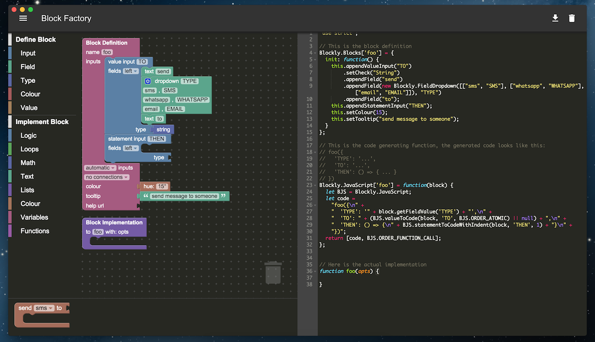

# Blocklymer

Blocklymer = Blockly + Polymer + Electron


## What's this?



This is just another blockly editor. Like the blockly factory demo, you drag blocks around(on the workspace on the right) to create your block, the preview(at the bottom right) and the code editor(on the left) will be updated automatically. You can also write the internal block logic code and download a .js file to use in other blockly project.

## Howto

### Install

`bower install --save blocklymer`

### Run

#### On Browser

```bash
# You need a local web server, for example:
npm i -g http-server
http-server . -s
```

#### With Electron

```bash
# If you don't have electron yet, do this first:
npm i -g electron-prebuilt

# Then we can launch the project as a native app on your computer:
electron .
```
